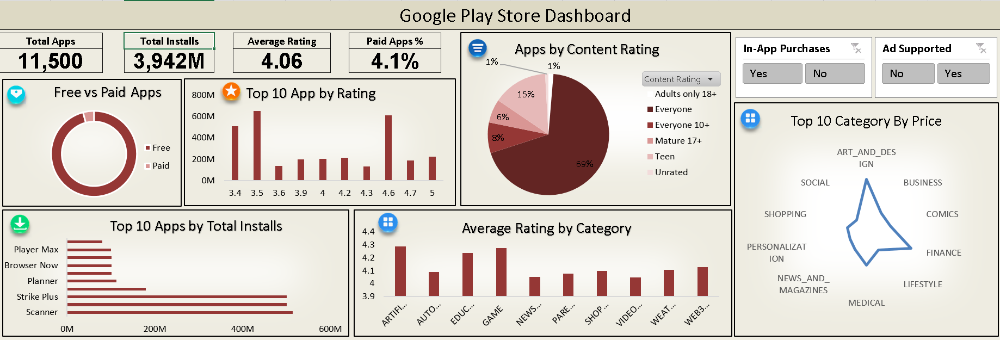

# 📱 Google Play Store Data Analysis Dashboard

An interactive Excel dashboard analyzing **11,500 apps** from the Google Play Store, uncovering insights around installs, ratings, pricing, content categories, and user engagement features.



## 📊 Overview

This project explores Google Play Store app data to answer key questions like:
- Which apps and categories dominate the market?
- How do free and paid apps compare?
- What's the relationship between app category, pricing, and rating?
- How common are in-app purchases and ads?

The final output is a single-page, fully interactive **Excel dashboard** built using PivotTables, PivotCharts, and slicers.

## 🔑 Key Metrics

| Metric | Value |
|---|---|
| Total Apps | 11,500 |
| Total Installs | 3,942M |
| Average Rating | 4.06 |
| Paid Apps | 4.1% |

## 📈 Dashboard Features

- **Free vs Paid Apps** — donut chart comparing distribution of free and paid apps
- **Top 10 Apps by Rating** — bar chart of highest-rated apps
- **Apps by Content Rating** — pie chart breakdown (Everyone, Teen, Mature 17+, Adults only 18+, Unrated)
- **Top 10 Apps by Total Installs** — most-installed apps overall
- **Average Rating by Category** — comparison across categories like Games, Education, AI, Finance
- **Top 10 Category by Price** — radar chart comparing pricing across categories
- **Interactive Slicers** — filter the dashboard by:
  - In-App Purchases (Yes/No)
  - Ad Supported (Yes/No)

## 🗂️ Repository Structure

```
google-playstore-data-analysis/
│
├── google-playstore-data-analysis.xlsx   # Main workbook (data + pivot tables + dashboard)
├── Dashboard.png                         # Dashboard screenshot
└── README.md                             # Project documentation
```

## 📁 Inside the Workbook

The Excel file contains multiple sheets that power the dashboard:

| Sheet | Purpose |
|---|---|
| `dashboard` | Final interactive dashboard view |
| `Data` | Raw/cleaned dataset (App, Category, Rating, Installs, Price, Content Rating, etc.) |
| `insights` | Notes and key takeaways |
| `pricebycate` | Average price by category (Pivot) |
| `Appbyrateing` | App count by content rating (Pivot) |
| `freevspaid` | Free vs paid app counts (Pivot) |
| `Top10Apps` | Top apps by total installs (Pivot) |
| `Total install` | Installs grouped by rating (Pivot) |
| `AVG Rating` | Average rating by category (Pivot) |
| `no of install` / `count of num` / `AVGrating` | Summary KPI calculations |

## 🧾 Dataset Fields

The core dataset (`Data` sheet) includes the following columns:

- **App** – Application name
- **Category** – App category (e.g., Family, Education, Business)
- **Rating** – Average user rating
- **Reviews** – Number of reviews
- **Size** – App size
- **Installs** – Install range (e.g., 500,000,000+)
- **Installs_Numeric** – Numeric install count for calculations
- **Type** – Free or Paid
- **Price** – App price (USD)
- **Content Rating** – Age/content classification
- **Genres** – App genre
- **Last Updated** – Date of last update
- **Current Ver / Android Ver** – Version compatibility
- **In-App Purchases** – Yes/No
- **Ad Supported** – Yes/No

## 🛠️ Tools Used

- **Microsoft Excel** – Data cleaning, PivotTables, PivotCharts, Slicers, Dashboard design

## 🚀 How to Use

1. Download `google-playstore-data-analysis.xlsx`
2. Open it in Microsoft Excel (or a compatible spreadsheet tool that supports Slicers)
3. Navigate to the `dashboard` sheet
4. Use the **In-App Purchases** and **Ad Supported** slicers to filter insights dynamically
5. Explore individual pivot sheets for deeper analysis

## 💡 Key Insights

- The vast majority of apps (**~96%**) are free, with only **4.1%** being paid
- Most apps fall under the **"Everyone"** content rating (**69%**)
- Categories like **Games** and **Education** tend to have higher average ratings
- A small number of top apps account for a disproportionately large share of total installs

## 👤 Author

**Akshay Nikam** ([@akshaynikam0407](https://github.com/akshaynikam0407))

## 📄 License

This project is open for learning and portfolio purposes. Feel free to fork and build upon it.
